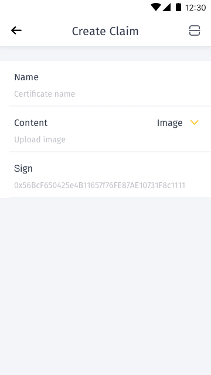
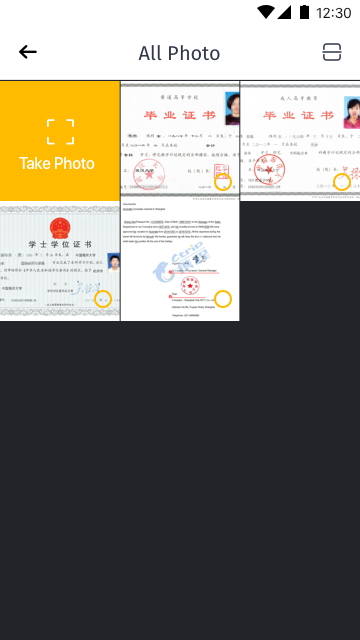
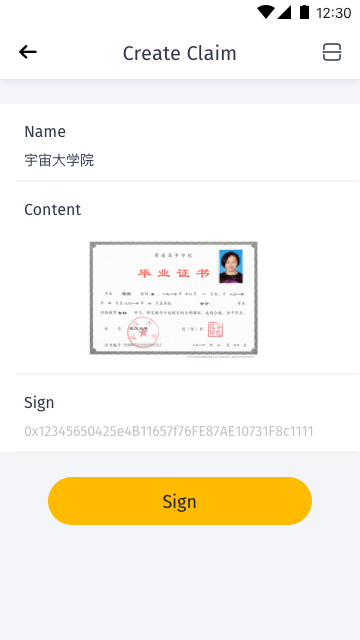
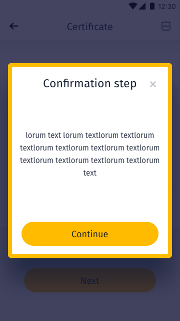

[ReadMe](../README.md) / [需求規格](../requirements.md) / 声明 Claim

# 声明 Claim

* 声明 Claim 画面

	* 状态为空:

		

	* 清单:

		

	* 创建声明

		
		
		
		

	* 声明项目

		
		

	*	检验声明

		

[ReadMe](../README.md) / [需求規格](../requirements.md) / 声明 Claim
