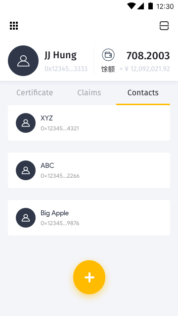
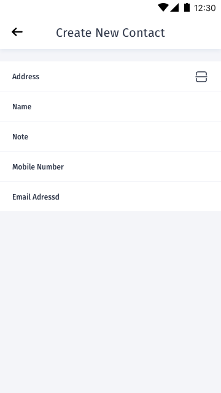
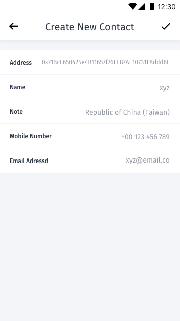
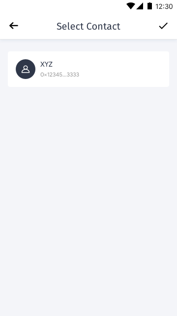
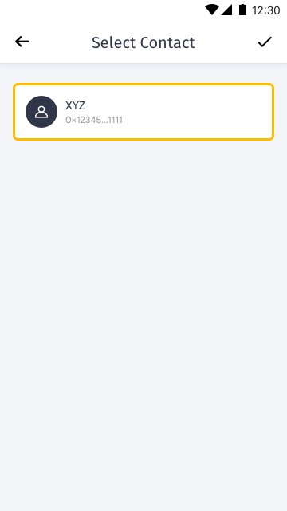

[ReadMe](../README.md) / [需求规格](../requirements.md) / 地址簿 Contacts

# 地址簿 Contacts

* 地址簿 Contacts 画面

	* 状态为空:
	
		

	* 清单:

		
		

	* 新增用户:

		
		

  * 選擇:
		
  	
  	
  
  * 编辑:[To do]

  * 删除:[To do]
  
* 二維碼掃描 QRCode Scan

[ReadMe](../README.md) / [需求规格](../requirements.md) / 地址簿 Contacts