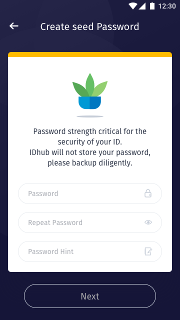
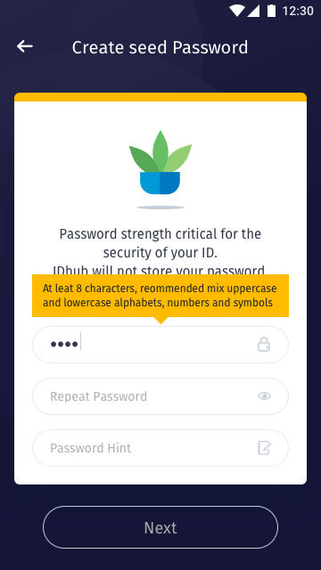
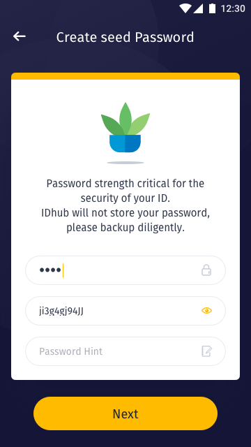

[ReadMe](../README.md) / [需求規格](../requirements.md) / [创建身分 Create Identity](create-identity.md) / 创建密码 Create password

# 创建密码 Create password

* 需求:
	* 提供用户创建密码

* 画面:
	* ## 创建密码 / Create seed Password

		
	
		* 栏位:

			栏位 | 实例 | 初始值 | 类型 | 规则与描述
			------------- | ------------- | ------------- | ------------- | -------------
			Status bar | Create seed Passwords | | |
			Content title| Password strength critical for the security of your ID. | | |
			Content paragraph | IDhub will not store your password, please backup diligently. | | |
			Input 1 | Password | text | Input |
			Input 2 | Repeat password | password | Input |
			Input 3 | Password Hint | text | Input |
			Button | Next | | Buttin |

	* ## 输入提示 / Create seed Password Tip

		

		* 栏位:

			栏位 | 实例 | 初始值 | 类型 | 规则与描述
			------------- | ------------- | ------------- | ------------- | -------------
			Tip | At leat 8 characters, reommended mix uppercase and lowercase alphabets, numbers and symbols   | | |

	* ## 密码提示 / Password hint

		

		* 栏位:

			栏位 | 实例 | 初始值 | 类型 | 规则与描述
			------------- | ------------- | ------------- | ------------- | -------------
			切换密码显示/隐藏 |  | | Icon | 点击 Icon 切换
			Button | Next | | Buttin | 验证栏位符合 ? Enable : Disable

[ReadMe](../README.md) / [需求規格](../requirements.md) / [创建身分 Create Identity](create-identity.md) / 创建密码 Create password