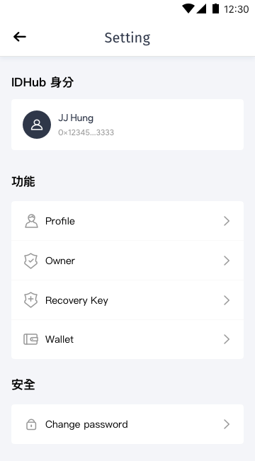

[ReadMe](../README.md) / [需求規格](../requirements.md) / [数字身分 Identity](identity.md) / 设置

# [设置](identity-setting.md)

* 画面

	

* 需求

	* 提供用户设置功能
		* 编辑用户信息
		* 编辑所有人乙太地址
		* 编辑复原乙太地址
		* 编辑钱包资产估值单位
		* 编辑密码

* 栏位

	栏位 | 实例 | 初始值 | 类型 | 规则与描述
	------------- | ------------- | ------------- | ------------- | -------------
	Status bar | Setting | | |
	
	* IDHub 身分

		栏位 | 实例 | 初始值 | 类型 | 规则与描述
		------------- | ------------- | ------------- | ------------- | -------------
		头像 |  | | |
		用户名 |  | | |
		地址 |  | | |
	
		* [用户地址 Address](id-address.md)

	* 功能

		* [设置用戶信息 Profile Manage](setting-profile.md)

		* [设置所有人 Owner Manage](setting-owner.md)

		* 设置恢复 Recovery Manage [Next Version]

		* [设置钱包 wallet Manage](setting-wallet.md)

	* 安全

		* [安全 Security](setting-security.md) [Next Version]

[ReadMe](../README.md) / [需求規格](../requirements.md) / [数字身分 Identity](identity.md) / 设置