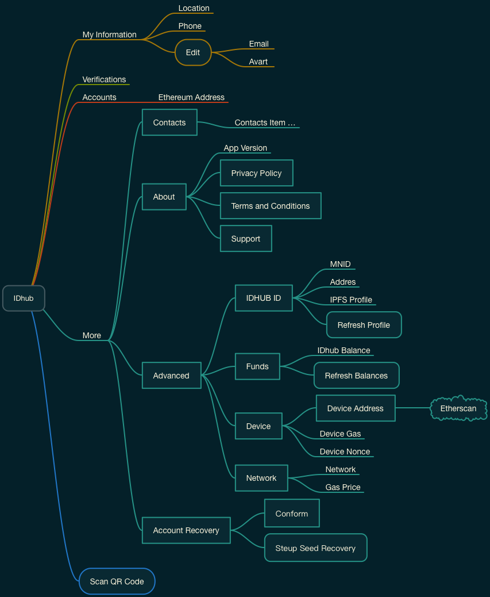

# Identity

* 用户信息 My Information
	* 地理信息 Location
	* 行动电话 Phone
	* 编辑 Edit
		* Email
		* 头像 Avart

* Verifications

* Accounts

* 更多 More
	* 联系清单 Contacts(List)
		* 联系项目 Contacts Item …

	* 关于 About
		* 应用版本 App Version
		* 隐私权 Privacy Policy
		* 使用条款 Terms and Conditions
		* 支持 Support

	* 进阶 Advanced
		* IDHub ID
			* MNID
			* Addres
			* IPFS Profile
			* Refresh Profile

		* Funds
			* IDHub Balance
			* Refresh Balances
	
	* 设备 Device
		* 设备地址 Device Address
			* Etherscan
		* Device Gas
		* Device Nonce
	
	* Network
		* Network
		* Gas Price
	
	* 帐号恢复 Account Recovery
		* Conform
		* 安装种子恢复 Steup Seed Recovery

## Scan QR Code

## 身份创建
说明：
让用户完成身分创建程序

身份创建  | 描述  | 必要
------------- | ------------- | -------------
创建  | <ol><li>调用 Identity Contract 布署 Proxy Contract</li><li>Proxy Contract Add 等于身分</li><li>Owner key 拥有此身分</li><li>Owner key 相当是一个密码</li> | <ul><li>OWNER KEY</li><li>RECOVRY KEY</li></ul>

## 注册 / Registry
说明：
保证从其他数字身分服务商的迁移支持

身份注册  | 描述
------------- | -------------
注册  | --

## 还原/恢复
身份还原  | 描述
------------- | -------------
--  | <ol><li>使用 Owner key 私钥签名宣称拥有身分</li></ol>

## Identity Manager

Identity Manager 调用身份  | 描述
------------- | -------------
--  | --

### 增加装置

增加装置  | 描述
------------- | -------------
自主  | --
代理  | --

### 移除装置

移除装置  | 描述
------------- | -------------
自主  | --
代理  | --

### 迁移装置

迁移装置 | 描述
------------- | -------------
--  | --

## 点对点验证

点对点验证  | 描述
------------- | -------------
验证身份拥有者() | --
乱数产生 | --

## 签名功能

签名功能  | 描述
------------- | -------------
动态讯息签署 | --
验证签名有效性 | --

## 合约
合约/服务功能使用请求执行  | 描述
------------- | -------------
--  | --

### 撤销
撤销  | 描述
------------- | -------------
撤销  | --