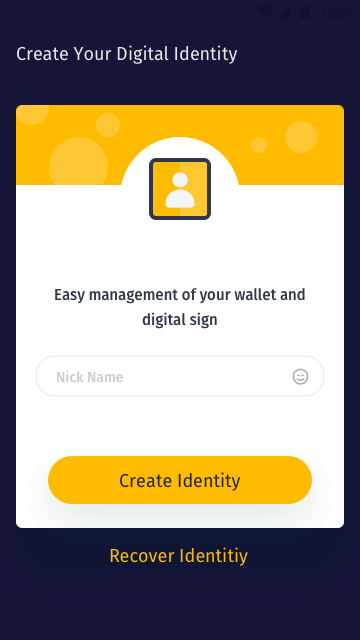
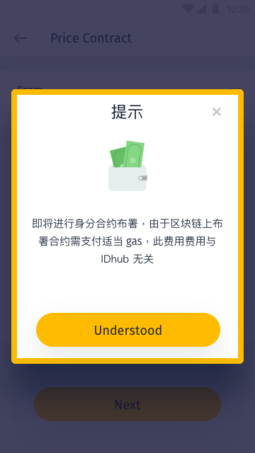
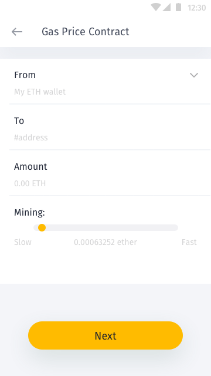
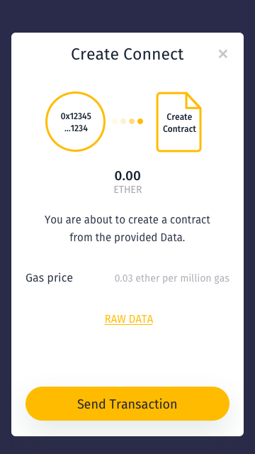

# Identity

用户需求:

进行需身分认证之服务或应用交互。如：

* 查看或编辑需特定身分对象之网站内容或交换文本消息或电子邮件。
* 购买需身分认证之商品或申请贷款，如：证明其符合饮酒年龄或一幅土地的所有者交易可能是合法的。

因此身分系统必须要满足并支持以下特点

* 实体之间的交互
	* 身份系统的主要目的是使得实体能够互相交流。实体可以是一个人，一群人，一个组织，或一个非人类的计算代理。
	* 身份系统中的每个实体是唯一的，并可识别相对于身份系统内的所有其他实体，但可能只有匿名的，甚至匿名识别其他实体。
	* 识别系统提供实体之间的交易必须的，但并不只是与联网计算设备的帮助下执行。
		* 特性
			* 缺点，因为数字网络交易可能会遭受攻击、窃盗、伪造文件或其他诈欺或间接地通过意外泄露其数据聚合或监视。
			* 优点，因为数字网络不仅可以通过降低成本和扩大可能利益从事交易，而且采用的是可用于保护交易免受攻击的现代密码技术达到提高交易。尤其是后者，使实体参与，同时也是安全、私密的更有利的交易。

钱包资产项目画面

* 创建身分画面:

	
	
	
	

* 用户信息 My Information
	* 地理信息 Location
	* 行动电话 Phone
	* 编辑 Edit
		* Email
		* 头像 Avart

* Verifications

* Accounts

* 更多 More
	* 联系清单 Contacts(List)
		* 联系项目 Contacts Item …

	* 关于 About
		* 应用版本 App Version
		* 隐私权 Privacy Policy
		* 使用条款 Terms and Conditions
		* 支持 Support

	* 进阶 Advanced
		* IDHub ID
			* MNID
			* Addres
			* IPFS Profile
			* Refresh Profile

		* Funds
			* IDHub Balance
			* Refresh Balances
	
	* 设备 Device
		* 设备地址 Device Address
			* Etherscan
		* Device Gas
		* Device Nonce
	
	* Network
		* Network
		* Gas Price
	
	* 帐号恢复 Account Recovery
		* Conform
		* 安装种子恢复 Steup Seed Recovery

## Scan QR Code

## <a name="create-id">身份创建</a>

身分为实体(用户)的一个密码身份标识和属性子集的组合。 
身份可能有多个密码身份标识，但其中一个必须是主密钥，与此身份标识相关联，并且不与其他身份标识相关联。
因此，标识可以表示为由其主要身份标识索引的数据库中的数据结构或记录。 每个实体必须至少有一个身份。 由于密码学，身份可以保密。 如果一个密码被多次使用，它本质上是一个假名，用于解决一个未知的身份（但可能与某些已知的属性）。 一次加密提供完全匿名，但可以有其他机制使用现代密码提供匿名。

IDHub 应提供创建帐号功能，称之 IDHub 帐号，作为后续服务扩展使用。
帐号必须取得用户部分信息，如用户如以太地址、行动电话、EMAIL、帐号名称或用户昵称，用以识别。
透过验证机制，初步确保 IDHub 帐号所有者为 IDHub 帐户创建者，如:使用行动电话与EMAIL验证。
使用 IDHub 帐号，通过应用可导入自备地址或使用应用创建一以太地址，作为创建身分使用，称为 IDHub 身分。
用户即可透利用该身分作与其他身分产生交互，其内容可能包含身分标示、证书、令牌、能力、行为、属性、信誉、生物识别...等。

以下具备顺序型为以太地址生成流程

助记词 > 私钥 > 地址

以下具备顺序型为以太地址生成流程，故不讨论无助记词场景

以下无的定义: 代表与系统进行交互当下无法提供。
以下有的定义: 代表与系统进行交互当下可以或愿意提供。

用户 | 助记词 | 私钥 | 地址 | 场景
------------- | ------------- | ------------- | ------------- | -------------
A | 无 | 无 | 无 | 要求以各种形式提供地址，或使用系统创建
B | 有 | 无 | 无 | 要求以助记词生成私钥与地址，或使用系统创建
C | 有 | 有 | 无 | 要求以助记词生成地址，或使用系统创建
D | 有 | 有 | 有 | 填入地址，或使用系统创建
E | 有 | 无 | 有 | 

说明：
让用户完成身分创建程序

身份创建  | 描述  | 必要
------------- | ------------- | -------------
创建  | <ol><li>调用 Identity Contract 布署 Proxy Contract</li><li>Proxy Contract Add 等于身分</li><li>Owner key 拥有此身分</li><li>Owner key 相当是一个密码</li> | <ul><li>OWNER KEY</li><li>RECOVRY KEY</li></ul>

## 帐户创建

创建帐号与创建身分是不同的。
常见的数字产品帐户创建、识别、存储机制，皆无法符合身分之定义。
帐号属于身分其中一个别名(Aliases)。必须传导给用户以上的观念。常见的数字产品只有一个帐户，作为代表个人与系统与其他用户进行交互。...

用户需求:

...

## 注册
说明：
保证从其他数字身分服务商的迁移支持

身份注册  | 描述
------------- | -------------
注册  | --

## 还原/恢复

以下具备顺序型为IDHub身分(IDHub ID)生成流程

地址1(IDHub ID) + 地址2(私钥) > 合约生效

以下定义还原恢复需求场景

用户 | IDHub ID 地址 | Recovery Key 地址 | Owner | 符合条件 | 场景
------------- | ------------- | ------------- | ------------- | ------------- | -------------
A | 无 | 无 | 无 | Ｘ | IDHub ID 地址为恢复之必要条件
B | 无 | 有 | 有 | X | IDHub ID 地址为恢复之必要条件
C | 有 | 无 | 无 | X | Recovery Key 地址为恢复之必要条件
D | 有 | 有 | 无 | Ｏ | 可使用 Recovery Key 增加 Owner
E | 有 | 有 | 有 | Ｏ | 可使用 Owner 增加 Owner
F | 有 | 无 | 有 | Ｏ | 可使用 Owner 更换 Recovery key

<ol><li>使用 Owner key 私钥签名宣称拥有身分</li></ol>

## Identity Manager

Identity Manager 调用身份  | 描述
------------- | -------------
--  | --

### 增加装置

增加装置  | 描述
------------- | -------------
自主  | --
代理  | --

### 移除装置

移除装置  | 描述
------------- | -------------
自主  | --
代理  | --

### 迁移装置

迁移装置 | 描述
------------- | -------------
--  | --

## 点对点验证

点对点验证  | 描述
------------- | -------------
验证身份拥有者() | --
乱数产生 | --

## 签名功能

签名功能  | 描述
------------- | -------------
动态讯息签署 | --
验证签名有效性 | --

## 合约
合约/服务功能使用请求执行  | 描述
------------- | -------------
--  | --

### 撤销
撤销  | 描述
------------- | -------------
撤销  | --