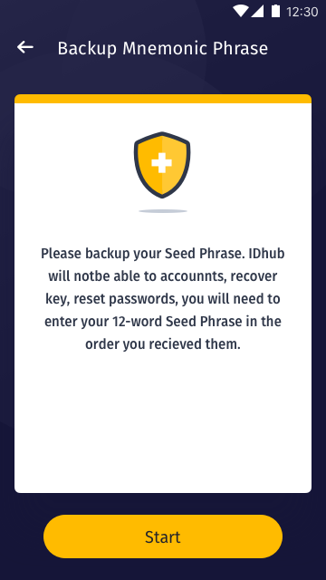
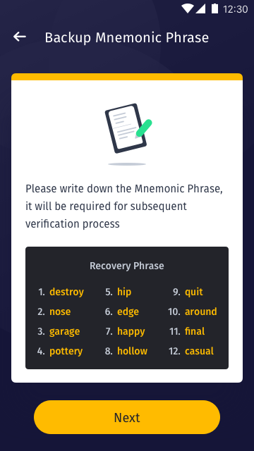
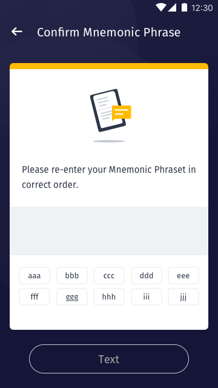

[ReadMe](../README.md) / [需求規格](../requirements.md) / [数字身分 Identity](identity.md) / [备份金钥 Backup](backup.md) / 助記詞 Mnemonic phrase

# 助記詞 Mnemonic phrase

* 任务起点

	

* 提示用户使用安全的方式储存注记词

	

* 助記詞备份(手动行为)

	

* 栏位

	栏位 | 实例 | 初始值 | 类型 | 规则与描述
	------------- | ------------- | ------------- | ------------- | -------------
	Status bar | Backup Mnemonic Phrase | | |

* 确认备份

	
	

* 栏位

	栏位 | 实例 | 初始值 | 类型 | 规则与描述
	------------- | ------------- | ------------- | ------------- | -------------
	Status bar | Confirm Mnemonic Phrase | | |

	* 依序点击注记词单词，下方区域单击放入上方; 上方区域单击放入下方

* 内容与标题文字确认后补上

[ReadMe](../README.md) / [需求規格](../requirements.md) / [数字身分 Identity](identity.md) / [备份金钥 Backup](backup.md) / 助記詞 Mnemonic phrase