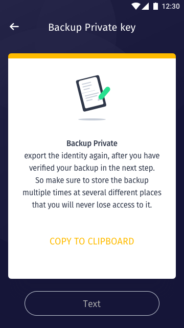
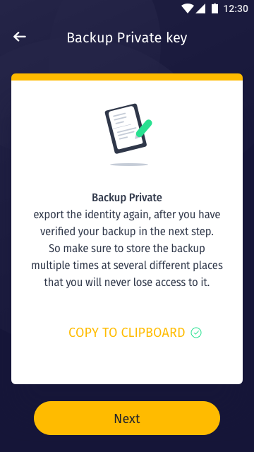
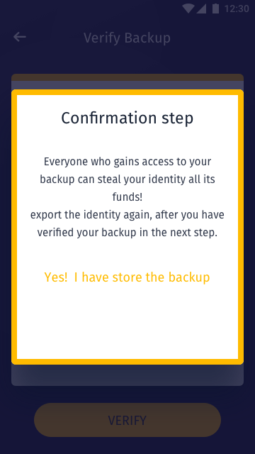
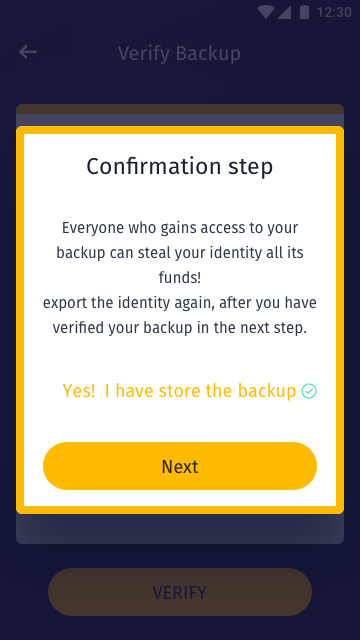
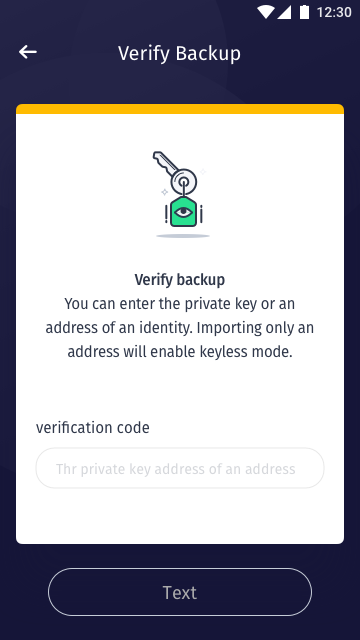
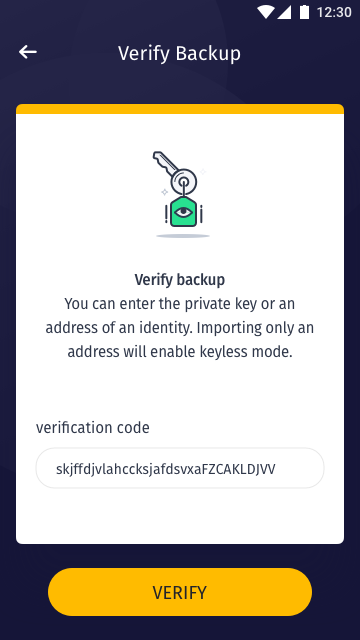
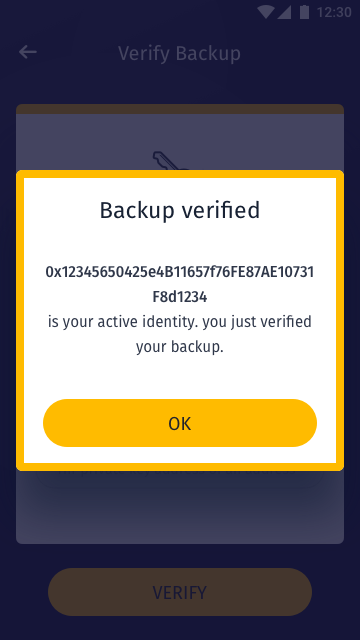
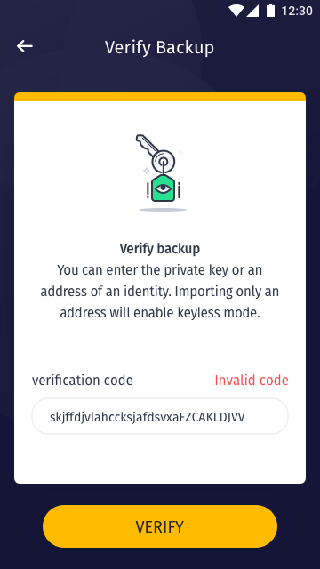

[ReadMe](../README.md) / [需求規格](requirements.md) / [数字身分 Identity](identity.md) / [备份金钥 Backup](backup.md) / 加密私钥 Private key

# 加密私钥 Private key

* 备份私钥方式: 点击复制至剪贴簿后，用户离开 APP 贴于安全位置(常见作法)。

	
	
	
	

* 验证私钥: 输入或贴上私钥验证该私钥地址是否符合

	
	

* 验证私钥成功: 输入或贴上私钥验证该私钥地址是否符合

	

* 验证私钥失败: 输入或贴上私钥验证该私钥地址是否符合

	

* 栏位

	栏位 | 实例 | 初始值 | 类型 | 规则与描述
	------------- | ------------- | ------------- | ------------- | -------------
	Status bar | Verify Backup | | |

* 内容与标题文字确认后补上

[ReadMe](../README.md) / [需求規格](requirements.md) / [数字身分 Identity](identity.md) / [备份金钥 Backup](backup.md) / 加密私钥 Private key