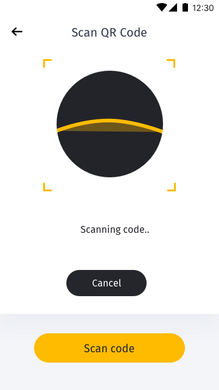
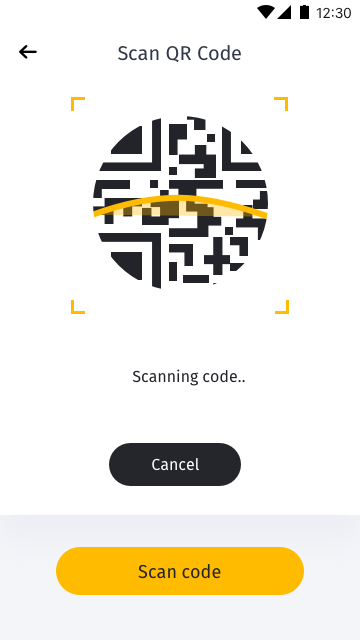

[ReadMe](../README.md) / [需求規格](../requirements.md) / 二維碼掃描 QRCode Scan

# 二維碼掃描 QRCode Scan

* 二維碼掃描 QRCode Scan 画面
	
	
	

* 需求
	* 用户可使用二維碼掃描对方二維碼后进行转出
	* 用户可使用二維碼掃描，授权认证用户单一登入(SSO)[To do]

* 栏位

栏位 | 实例 | 初始值 | 类型 | 规则与描述
------------- | ------------- | ------------- | ------------- | -------------
扫描视窗 |  |  | 装置相机 | 
状态显示 | Scanning code... | Scan code |
取消按钮 |  | Cancel | 文字按钮 | 点击，触发取消扫描
扫描按钮 |  | Scan code | 文字按钮 | 点击，触发扫描

[ReadMe](../README.md) / [需求規格](../requirements.md) / 二維碼掃描 QRCode Scan