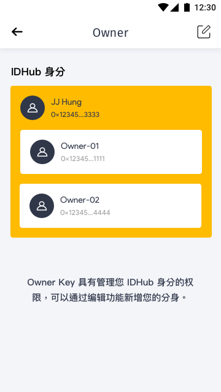
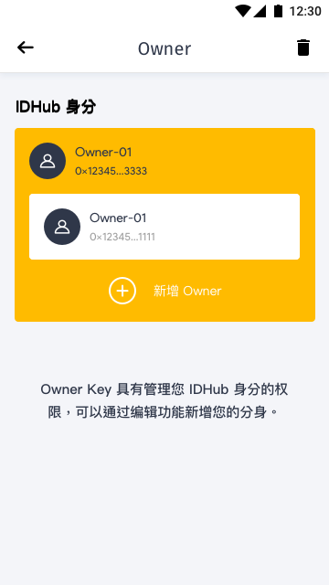
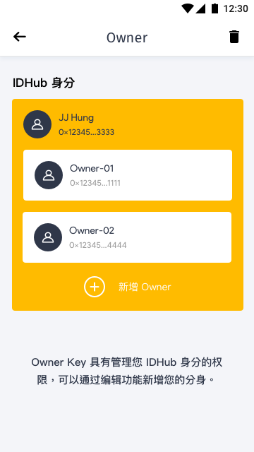
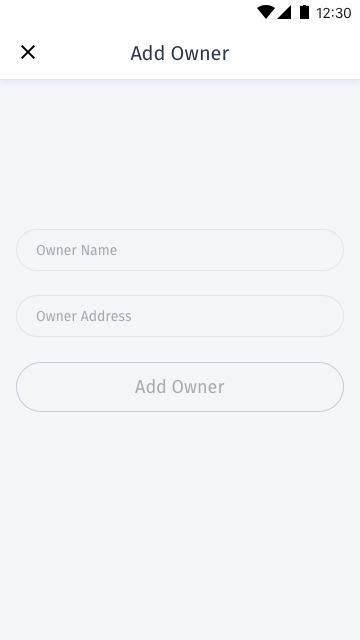
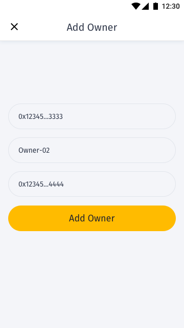
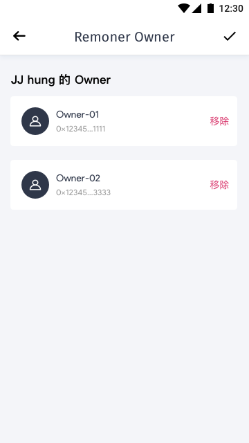
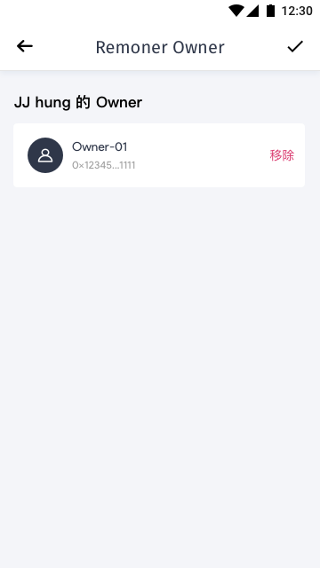

[ReadMe](../README.md) / [需求規格](../requirements.md) / [数字身分 Identity](identity.md) / [设置](identity-setting.md) / 所有人 Owner

# 所有人 Owner

## 新增 Owner

* 需求:
	
	* 提供用户管理所有人
	* 移除任务需与新增任务在 UI 操作上区隔开，增加行为难度，避免用户在不熟悉的情况下，移除所有人

* 画面:

	* 所有人清单

		
		

		* 点击右上角编辑，触发编辑模式

		* 栏位

			栏位 | 实例 | 初始值 | 类型 | 规则与描述
			------------- | ------------- | ------------- | ------------- | -------------
			Status bar | Owner | | | 
			头像 |  |  |  | 
			用户名 |  |  |  | 
			地址 |  |  |  | 
	
	* 编辑模式

		
		

		* 编辑模式于项目下方显示新增按钮，右上角触发移除模式

	* 新增所有人

		
		

		* 栏位

			栏位 | 实例 | 初始值 | 类型 | 规则与描述
			------------- | ------------- | ------------- | ------------- | -------------
			Status bar | Add Owner | | | 
			Owner Name |  |  |  | 
			Owner Address |  |  |  | 
			Button | Add Owner |  |  | 

		* 下一版支持 identity id 自定义

	* 移除所有人

		
		

		* 栏位

			栏位 | 实例 | 初始值 | 类型 | 规则与描述
			------------- | ------------- | ------------- | ------------- | -------------
			Status bar | Owner | | | 
			头像 |  |  |  | 
			用户名 |  |  |  | 
			地址 |  |  |  | 
			Button | 移除 |  |  | 

		* 所有人最小值 1，当所有人项目剩下 1 个时，不出现移除项目
		* 移除每个项目时必须弹出确认框，并说明上述条件

[ReadMe](../README.md) / [需求規格](../requirements.md) / [数字身分 Identity](identity.md) / [设置](identity-setting.md) / 所有人 Owner
