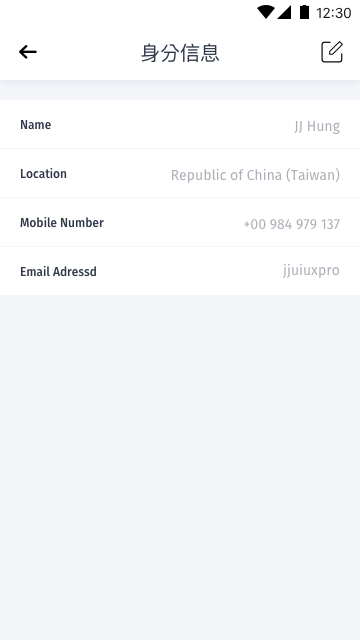
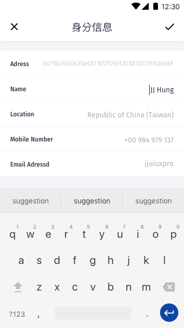

[ReadMe](../README.md) / [需求規格](../requirements.md) / [数字身分 Identity](identity.md) / [设置](identity-setting.md) / 用戶信息 Profile

# 用戶信息 Profile

* 画面

	* 信息
		
		
	
	* 编辑模式

		
		

* 栏位

	栏位 | 实例 | 初始值 | 类型 | 规则与描述
	------------- | ------------- | ------------- | ------------- | -------------
	用户名 |  | | |
	地区 |  | | |
	行动电话 |  | | | 正式上线需支援验证
	电子邮件信箱 |  | | | 正式上线需支援验证

[ReadMe](../README.md) / [需求規格](../requirements.md) / [数字身分 Identity](identity.md) / [设置](identity-setting.md) / 用戶信息 Profile