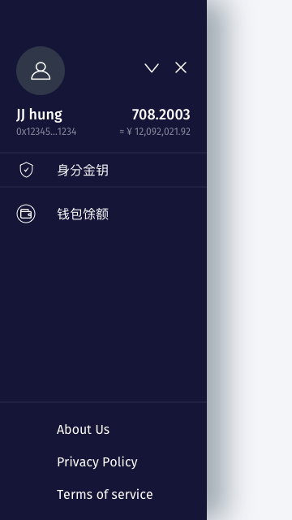
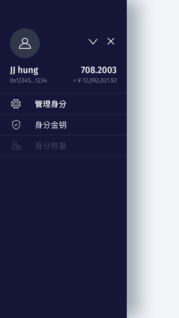

[ReadMe](../README.md) / [需求規格](../requirements.md) / 側欄 Side Navigation

# 側欄 Side Navigation

* 二維碼掃描 QRCode Scan 画面
	* 主功能

		
	
	* 进阶功能

		

* 需求
	* 通过侧栏菜单空间将信息分类
	* 最高优先(使用空间位置)
		* 用户信息(头像、用户名、地址)
		* 身分馀额(总额、估值)
	* 次高优先(选单)
		* 身分金钥
		* 主功能
	* 必要信息(选单)
		* 非功能之信息页面

[ReadMe](../README.md) / [需求規格](../requirements.md) / 側欄 Side Navigation