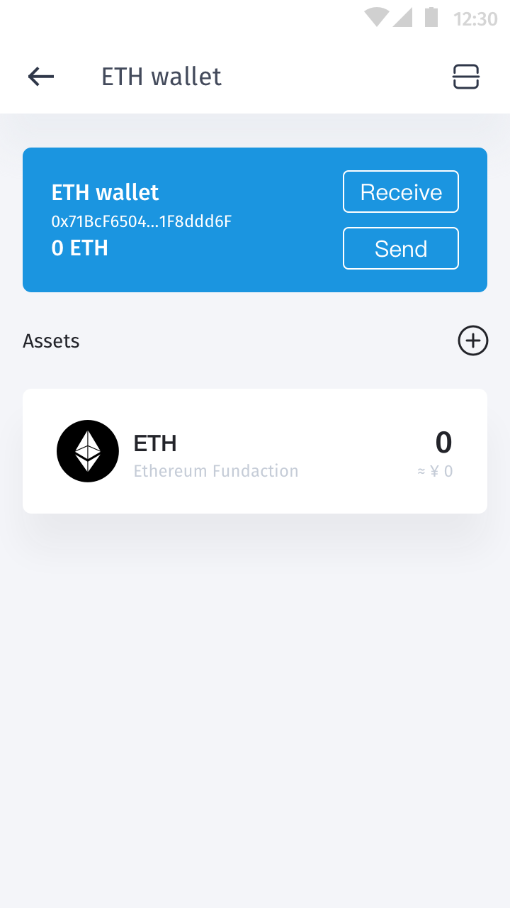
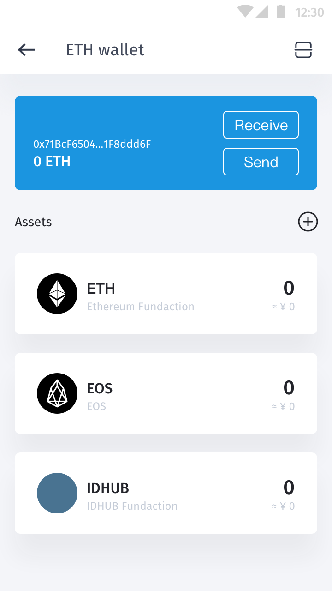
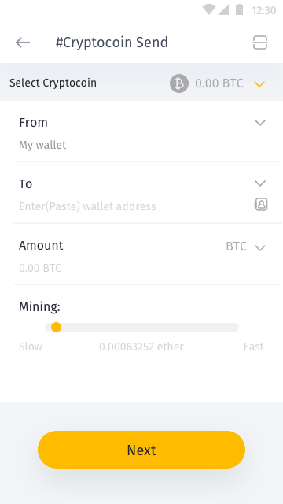
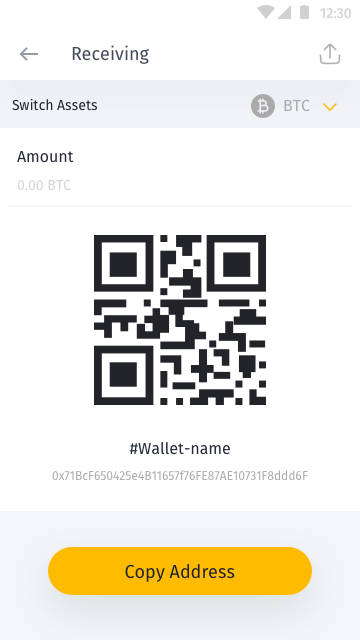
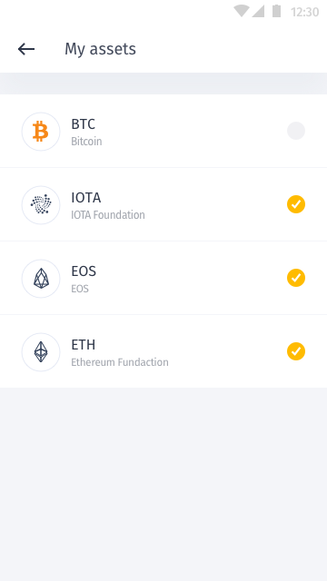

# 钱包

## 注册

* 规则
	* 用户在未登入时可点击“注册”进入注册画面。
	* 产生注记词。
	* 提示用户以安全的方式记录注记词。
	* 设定种子与重复确认密码。
	* 完成上述动作即产生以太地址，即可使用钱包收帐功能。
	* 创建身分需发布合约故需花费数位货币。

* 实例
	注册信息如下：
	* 用户名：jj
	* E-mail: jj@xxx.com
	* 地区: 日本
	* 勾选同意使用条款

## 钱包项目

* 需求
	* 钱包名称
		* 查
		* 改
	* 钱包地址
		* 显示前 4 码，后 5 码，中间...
		* 点击呈现完整长度
		* 快速复制地址
	* 馀额
		* 钱包资产总额

## 钱包清单

* 需求
	* 钱包名称
		* 查
		* 改
	* 钱包地址
		* 显示前 4 码，后 5 码，中间...
		* 点击呈现完整长度
		* 快速复制地址
	* 馀额
		* 钱包资产总额
	* 转帐
	* 收款
	* 资产列表
		* 资产
			* 图示
			* 资产名称
			* 资产发行单位
			* 法币汇率转换
	* 资产管理
	* 历史
		* 全部
		* 转出
			* padding
		* 转入
			* padding
		* 错误

### 转帐

* 需求
	* QRCode 扫码带入数值
	* 转出钱包名称
		* 切换钱包
	* 转入钱包
		* 输入地址
		* 选择联络人地址
	* 金额
		* 钱包资产总额
	* Mining
		* slid

### 收款

* 需求
	* 钱包名称
	* 钱包地址
	* 资产馀额
	* 钱包地址 QRCode
	* 馀额
		* 钱包资产总额
	* 转帐
	* 收款
	* 历史
		* 分类:
			* 全部
			* 转出
				* 状态:
					* normal
					* padding
			* 转入
				* 状态:
					* normal
					* padding
			* 错误

### 资产管理

* 需求
	* 资产清单
	* 提交资产
	* 操作
		* 多选

## 汇入钱包

## 私钥
功能名称  | 描述  | 描述
------------- | ------------- | -------------
产生  | -- | 
汇入  | -- |
汇出  | -- |

资产管理  | 描述
------------- | -------------
乙太币及ERC20通证管理  | 

收/转帐  | 描述 | 栏位
------------- | ------------- | -------------
收帐  | 提供地址 | <ul><li>地址</li><li>QRCode</li><li>金额</li></ul>
转帐  | 提供地址 | <ul><li>地址</li><li>QRCode</li><li>金额</li></ul>

去中心化交易所兑换串接  | 描述
------------- | -------------
--  | --

QRCode 扫描  | 描述
------------- | -------------
收帐  | --
转帐  | --