[ReadMe](../README.md) / [需求規格](../requirements.md) / Wallet 钱包

# 钱包

* 画面:
	* [钱包总览](wallet_overview.md)
		* [钱包总览元件](wallet_overview.md#overview)
		* [钱包项目元件](wallet_overview.md#wallet-item)
	* [钱包清单](wallet_list.md)
		* [资产总览元件](wallet_list.md#wallet-item)
		* [资产项目元件](wallet_list.md#assets-item)
	* [资产项目](wallet_asset-item.md)
		* [资产所属钱包元件](wallet_asset-item.md#wallets__assets-item_qrcode)
	* [转帐](wallet_send.md)
	* [收帐](wallet_receive.md)
	* [资产管理](wallet_assets-manage.md)
	* [创建钱包](wallet_create.md)
	* [汇入钱包](wallet_import.md)
	* 同意使用条款

* 功能:
	* [创建钱包](wallet_create.md)
	* [恢复钱包](wallet_import.md)
	* [资产管理](wallet_assets-manage.md)
	* [历史](wallet_history.md)
		* [总览历史](wallet_history.md#overview-history)
		* [钱包历史](wallet_history.md#list-history)
		* [资产历史](wallet_history.md#assets-history)
	* [QRCode 扫描](qrcode.md)

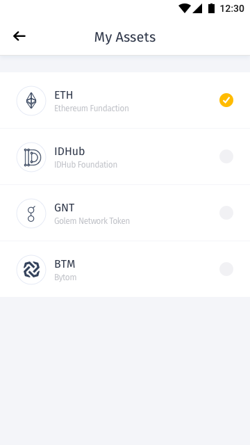
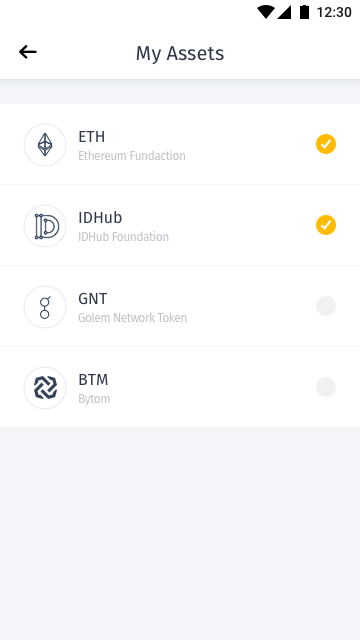
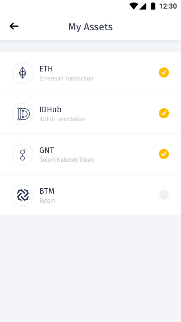
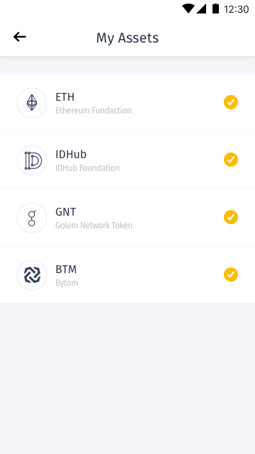

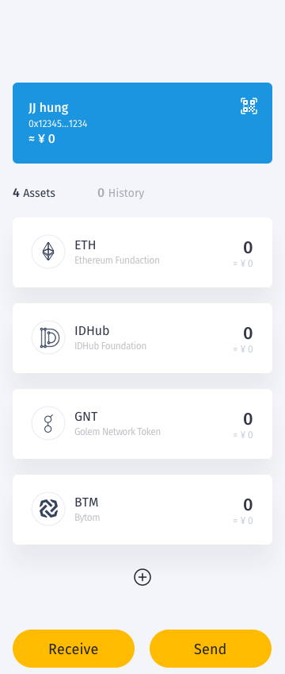
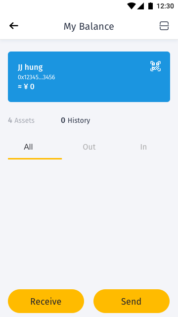
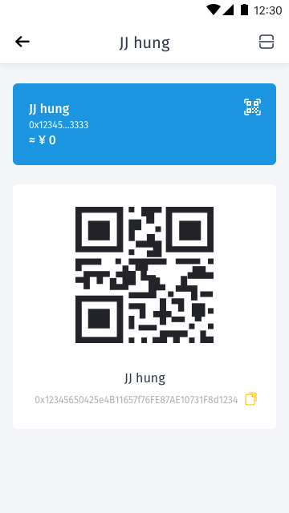
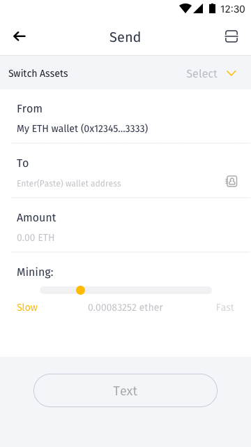
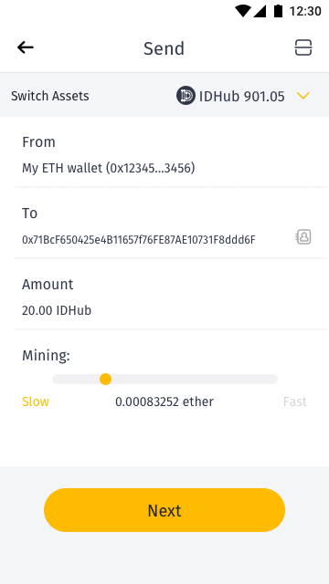
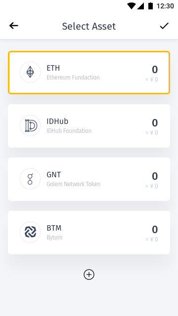
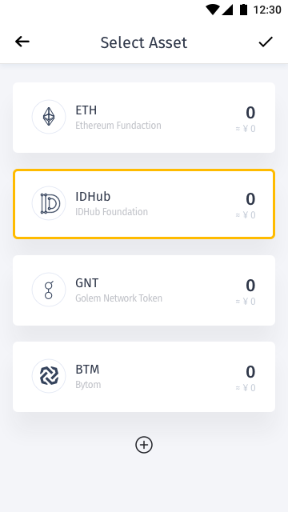
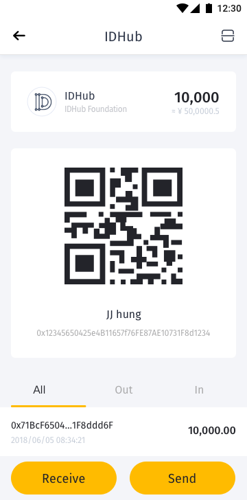
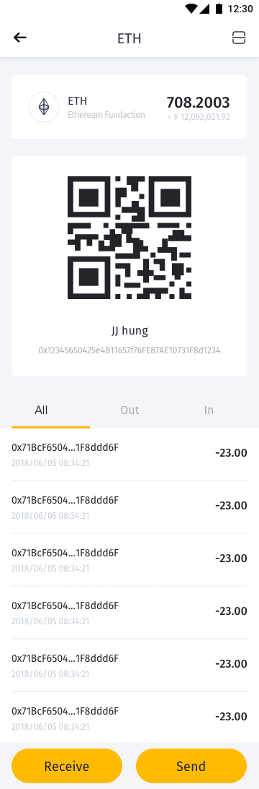
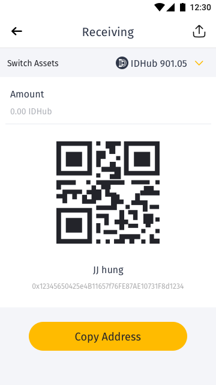
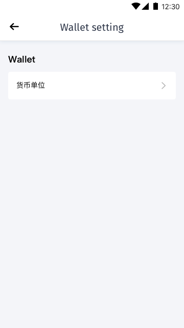

[以下待整理]

## 私钥
功能名称  | 描述  | 描述
------------- | ------------- | -------------
产生  | -- | 
汇入  | -- |
汇出  | -- |

资产管理  | 描述
------------- | -------------
乙太币及ERC20通证管理  | 

收/转帐  | 描述 | 栏位
------------- | ------------- | -------------
收帐  | 提供地址 | <ul><li>地址</li><li>QRCode</li><li>金额</li></ul>
转帐  | 提供地址 | <ul><li>地址</li><li>QRCode</li><li>金额</li></ul>

去中心化交易所兑换串接  | 描述
------------- | -------------
--  | --

QRCode 扫描  | 描述
------------- | -------------
收帐  | --
转帐  | --

[ReadMe](../README.md) / [需求規格](../requirements.md) / Wallet 钱包