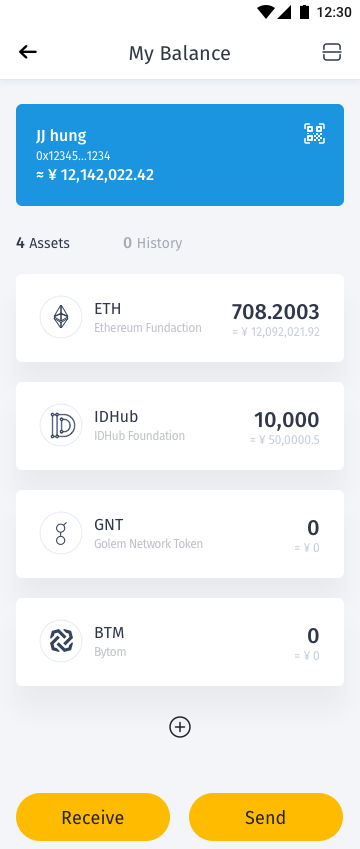
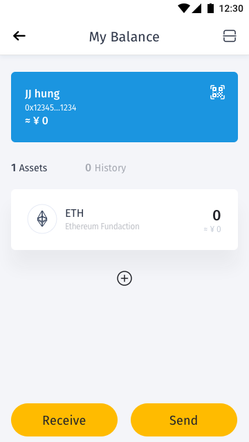
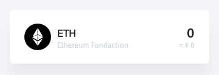
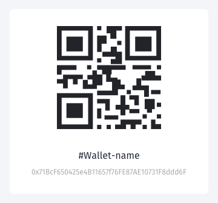

[ReadMe](../README.md) / [需求規格](../requirements.md) / [Wallet 钱包](wallet.md) / 资产项目

# <a name="asset-item">资产项目</a>

钱包资产项目画面

* 资产项目画面:

	

* 资产项目初始画面(空):

	

* 需求
	* 用户透过介面，可检视该资产信息
		* 资产所属钱包名称
		* 资产所属钱包地址
		* 资产所属钱包 QRCode
		* 资产识别名称
		* 资产识别图标
		* 资产发行组织
		* 资产馀额
		* 资产估值
		* 资产转出、入历史
			* 分类
				* 全部
				* 转出
				* 转入
			* 状态
				* Padding
				* Failed
	* 用户可快速进行收帐
	* 用户可快速进行转帐
	* 支持 二維碼掃描

* 功能
	* 触发收帐任务
	* 触发转帐任务
	* 二維碼掃描

* 栏位

	## [资产项目元件](wallet_list.md#assets-item)
	
	
	
	## <a name="wallets__assets-item_qrcode">资产所属钱包元件</a>
	
	
	
	栏位 | 实例 | 初始值 | 类型 | 规则与描述
	------------- | ------------- | ------------- | ------------- | -------------
	资产所属钱包 QRCode |  |  |  | 
	资产所属钱包名称 | JJ Hung |  | 字元 | 
	资产所属钱包地址 | 0x71BcF650425e4B11657f76FE87AE10731F8ddd6F |  | 字元 | 
	
	## [资产历史](wallet_history.md#assets-history)
	* 如无信息不显示
	
[ReadMe](../README.md) / [需求規格](../requirements.md) / [Wallet 钱包](wallet.md) / 资产项目