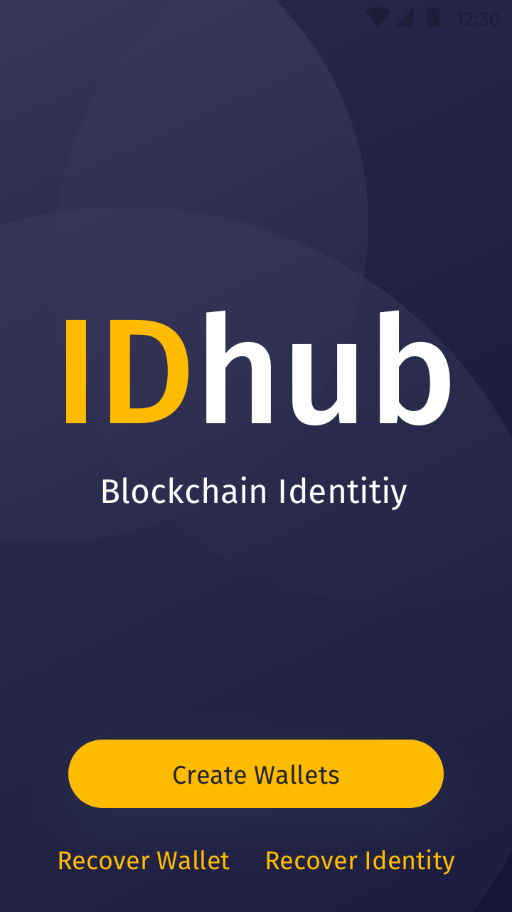
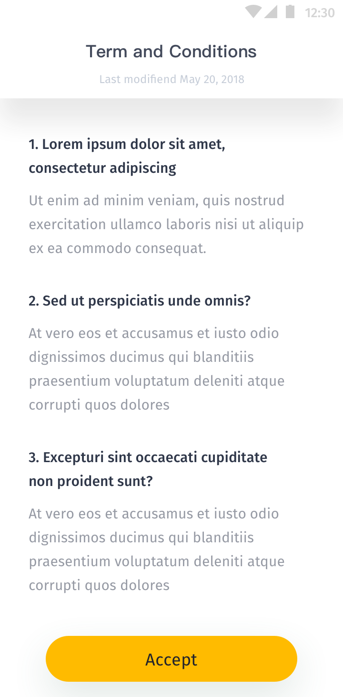
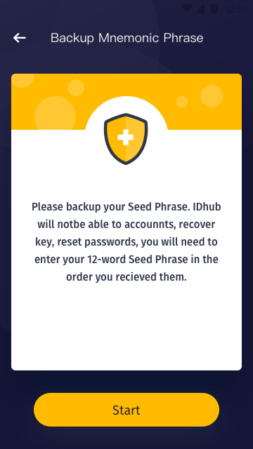
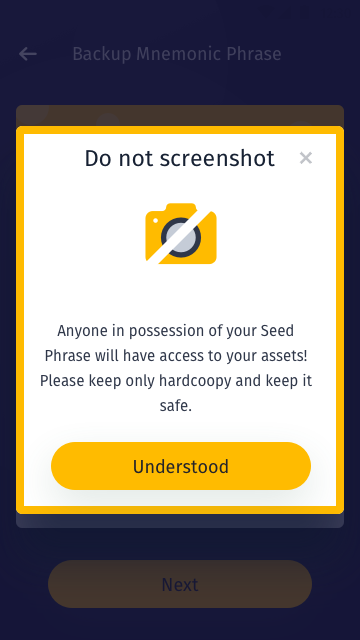
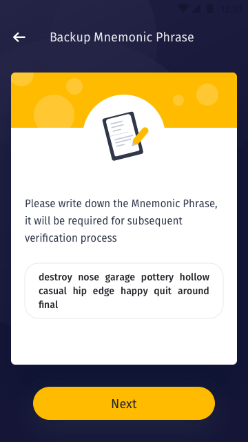
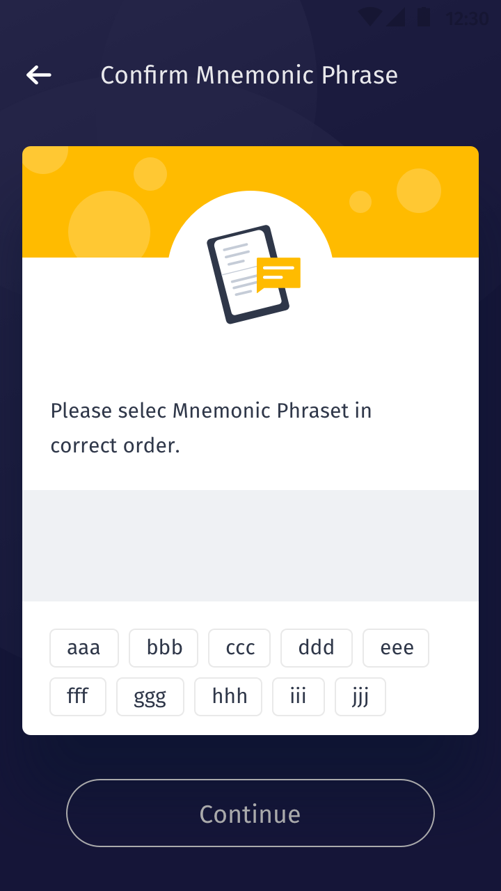
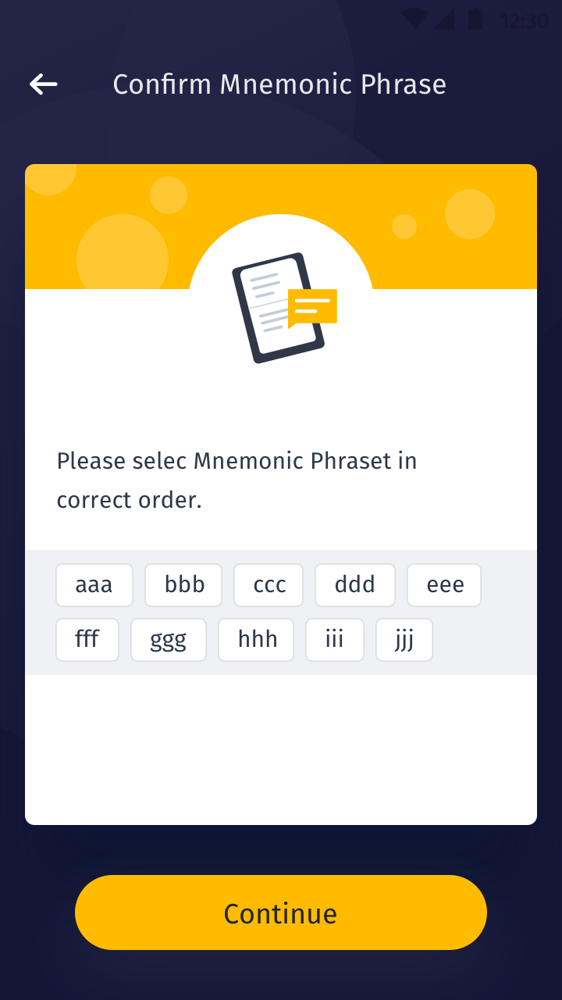
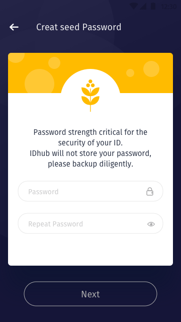
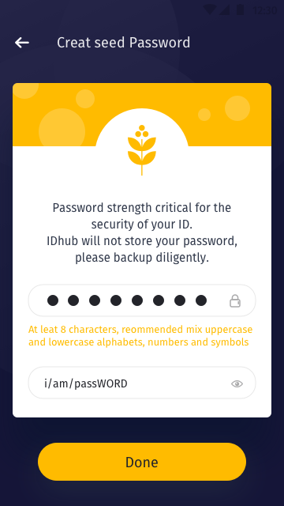
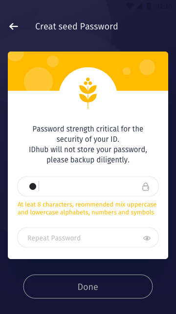

[ReadMe](../README.md) / [需求規格](../requirements.md) / [Wallet 钱包](wallet.md) / 创建钱包

# <a name="create-wallet">创建钱包</a>

* 规则

	* 用户类型:

用户  | 钱包地址  | IDHub Proxy | 操作 | 说明
------------- | ------------- | ------------- | ------------- | -------------
A  | 无 | 无 | 创建钱包 > 注册身分 | 创建钱包，使用 IDHub 自带以太地址，注册 Proxy
B  | 有 | 无 | 恢复钱包 > 注册身分 | 恢复钱包，使用自备以太地址，注册 Proxy
C  | 有 | 有 | 恢复身分 | 恢复身分，恢复地址

* A 用户 规则 
	* 用户在未登入时可点击“创建钱包”进入。
	* 勾选使用条款。
	* 产生注记词。
	* 提示用户以安全的方式记录注记词。
	* 设定种子与重复确认密码。
	* 完成上述动作即产生以太地址，即可使用钱包收帐功能。
	* 创建身分需发布合约故需花费数位货币。

* 实例
	注册信息如下：
	* 用户名：jj
	* E-mail: jj@xxx.com
	* 地区: 日本
	* 勾选同意使用条款

[ReadMe](../README.md) / [需求規格](../requirements.md) / [Wallet 钱包](wallet.md) / 创建钱包