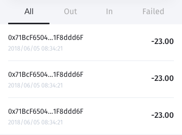

[ReadMe](../README.md) / [需求規格](../requirements.md) / [Wallet 钱包](wallet.md) / 历史

# 资产历史

* 资产历史元件

	
	
* 需求
	* 用户透过介面可查阅交易历史
	* 分类：
		* 全部
		* 转出
			* 状态:
				* padding
		* 转入
			* 状态:
				* padding
		* 错误
	* 信息：
		* 交易地址
		* 交易时间
		* 交易金额 
		* 交易单位

* 栏位

栏位 | 实例 | 初始值 | 类型 | 规则与描述
------------- | ------------- | ------------- | ------------- | -------------
分类 | All、Out、In、Failed |  | Tab | 
交易地址 | 0x71B…ddd6F |  | 任意字元 | 
交易时间 | 2018/06/05 08:34:21 |  | yyyy/mm/dd HH:MM:SS | 
交易金额 | 900.00 | 0 | 数字 | 转出(-) 转入(+)
交易单位 | ETH | | | 

* <a name="overview-history">总览历史</a>

	显示所有钱包所有资产，依时间排序

* <a name="list-history">钱包历史</a>

	显示该钱包所有资产，依时间排序

* <a name="assets-history">资产历史</a>

	显示该资产，依时间排序

[ReadMe](../README.md) / [需求規格](../requirements.md) / [Wallet 钱包](wallet.md) / 历史