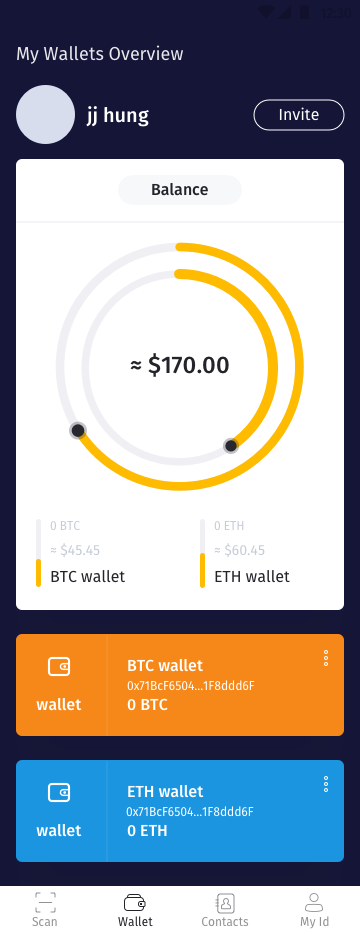
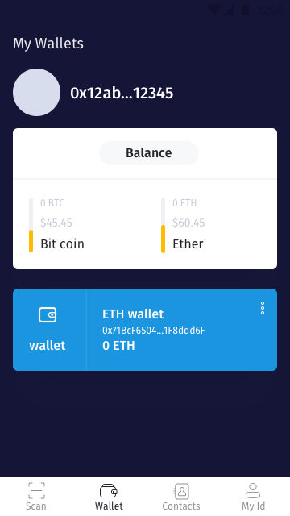
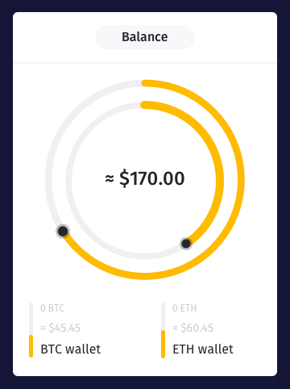

[ReadMe](../README.md) / [需求規格](../requirements.md) / [Wallet 钱包](wallet.md) / 钱包总览

# <a name="overview">钱包总览</a>

钱包总览画面

* 总览画面:

	

* 总览初始画面(空):

	

## <a name="overview">总览元件</a>

### 钱包馀额

* 需求
	* 用户透过介面，可检视总馀额，各钱包馀额
	* 用户透过设置，可自定总额单位符
	* 系统自动加总用户钱包之总额

* 栏位
	* 总馀额估值，如: `≈$170.00`
	* 钱包项目馀额，如: `0 ETH`
	* 钱包项目馀额估值，如: `≈$45.45`
	* 钱包项目名称，如: `ETH wallet`

栏位 | 实例 | 初始值 | 类型 | 规则与描述
------------- | ------------- | ------------- | ------------- | -------------
钱包项目名称 | ETH wallet | ETH wallet | 任意字元 | 
总馀额估值 | ≈$170.00 |  ≈ $0 | 数字 | 取至小数点第 2 位
钱包项目馀额 | 170.00 ETH | 0 ETH | | 取至小数点第 2 位
钱包项目馀额估值 | ≈$45.45 |  ≈ $0 |  | 取至小数点第 2 位

栏位 | 实例 | 初始值 | 类型 | 规则与描述
------------- | ------------- | ------------- | ------------- | -------------
符号 | ≈ | | | 估值
符号 | ETH | | | 数字货币单位
法币符号 | $ | 依用户所在地理位置 | | 用户可透过系统变更初始值

## <a name="wallet-item">钱包项目元件</a>

* 需求
	* 用户透过介面，可检视该钱包馀额
	* 系统自动加总用户资产之总额
	* 用户透过编辑，可变更钱包显示名称
	* 系统自带以太地址，可透过导入功能，导入自备地址
	* 用户可速复制地址

* 栏位
	* 图标
	* 钱包名称，如: `ETH wallet`
	* 钱包地址，如: `0x71B…ddd6F`
	* 钱包馀额，如: `≈$170.00`
	* 功能

* 功能
	* 编辑名称
	* 复制地址

栏位 | 实例 | 初始值 | 类型 | 规则与描述
------------- | ------------- | ------------- | ------------- | -------------
图标 |  | | 图片 | 
钱包名称 | ETH wallet |  | 任意字元 | 
钱包地址 | 0x71B…ddd6F |  |  | `前 4 码` + `...` + `后 5 码`
钱包馀额 | 900.00 | 0 | 数字 | 取至小数点第 2 位
钱包单位 | ETH | 0 | 字元 | 
功能 |  | | Icon | 点击触发

### 钱包项目元件操作功能
...
#### 编辑名称
...
#### 复制地址
...

[ReadMe](../README.md) / [需求規格](../requirements.md) / [Wallet 钱包](wallet.md) / 钱包总览