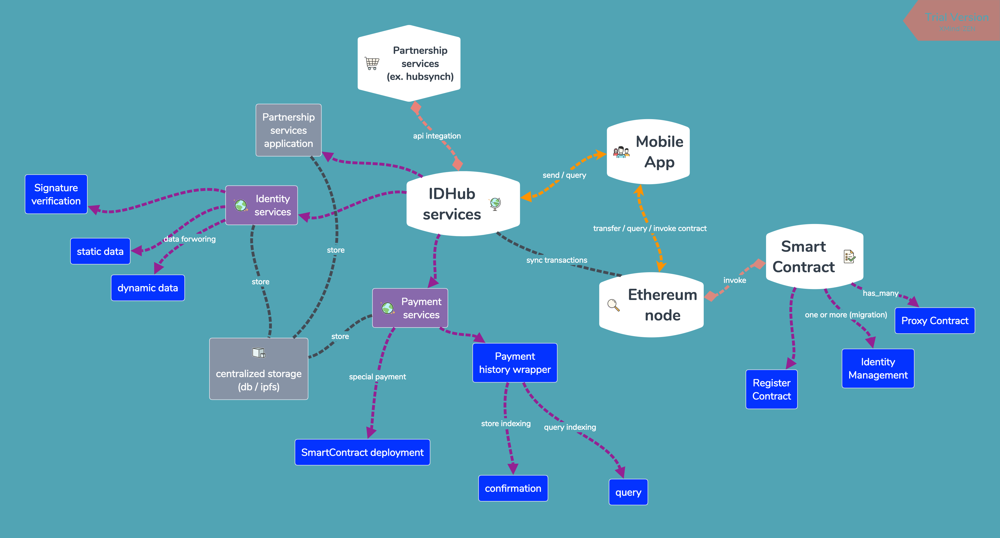
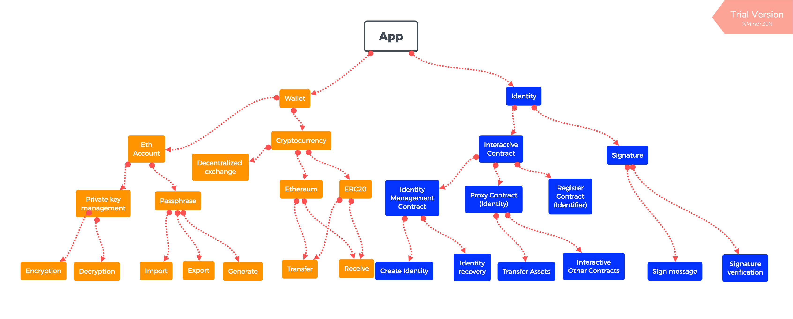
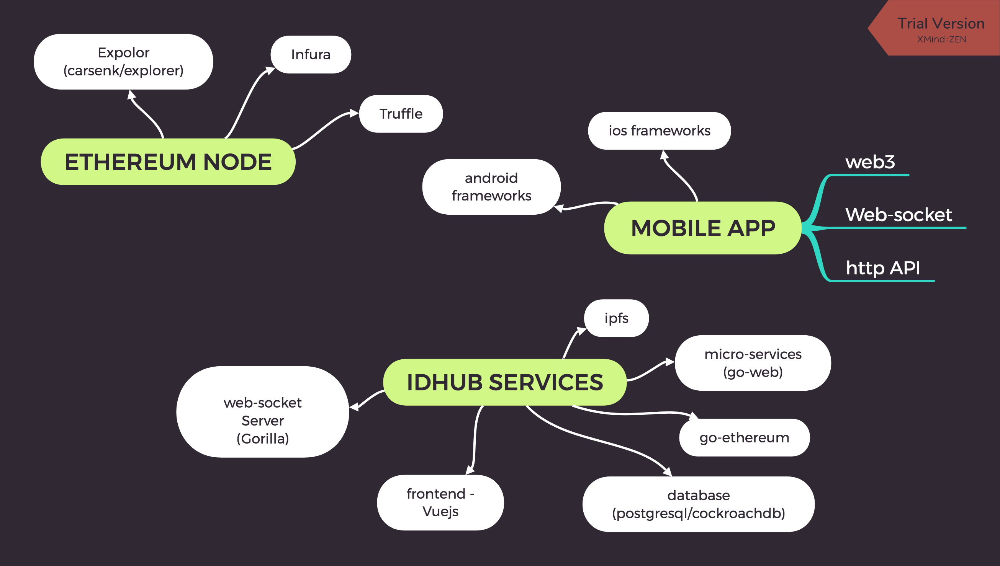

## IDHUB System Architecture

* 描述整体基本开发架构scope. IDHub Services 作為一个中介层. 初期因应需求只有
  * identity services
    * 与链上的互动都需要透过乙太坊节点与链上沟通, 建立一个中央式的存储空间作為资讯交换及加快响应速度功能使用. 依据不同资料属性设定TTL (Time to live)设置存储更新时间点.
    * static data 作為静态资料, 会分别储存在中央式存储已经链上.
    * dynamic data 作為动态资料, 会透过app发起签署, 取回签署, 分享签署的方式分享给其他使用者, 不一定需要存储在链上.
  * payment services
    * payment services 基本上只作為查询支付是否完成已经查询支付资讯. 支付本身行為在链上及个别节点送出交易广播完成
    * smart contract: 基本上以目前uport提供的部份為基本参考

* 描述App个别区块需要达成的功能
  * Wallet:
    * 私讑建立管理加解密
    * 助记词
    * 资产管理移转操作
  * Identity:
    * 与智能合约互动
      * 部属身份
      * 取回身份
      * 加入识别属性
      * 转移链上资产
      * 透过链上身份与其他合约互动
    * 签署
      * 点对点发起签名需求
      * Dapp 签名认证需求
      * 签名内容验证
      * 签名内容分享

* 描述开发环境会使用到的技术架构, 在此阶段以开发环境来架构设计, 上线版本可依照需求改变
  * Mobile app
    * web3 (v1.0):
      * 大致上与链的交互工作都可以透过web3 client函式库与乙太坊节点沟通
      * 资产的管理及转移
      * 私讑签名
      * 合约调用查询
    * web-socket:
      * 可以透过websocket实做类似IM的功能.
      * 使用web-socket作為分享签名内容的途径
    * http api:
      * 与后端伺服器互动 (依需求整合)
  * IDHub services
    * micro services
      * 采用服务导向作法建立不同的api server
      * 基本上不限定web 框架. 以golang开发為主
    * 前端
      * 采用Vuejs作為前端框架
    * go-ethereum
      * 如果有一些需要在后端与链互动及执行乙太坊工作的需求采用原生的函式库
      * nodejs 的情况下可以直接使用web3
    * web-socket
      * 以Gorilla go 函式库作為server
    * database
      * postgresql
      * cockroachdb
        * postgresql compatible dastabase written by golang
    * ipfs
      * 作為资料库存储外的第二存储选择   
  * Ethereum
    * node:
      * 本机测试开发可以只用truffle ganache
      * 测试网可以使用infura
      * 须评估上线是否需要自己架设full node节点
    * expolor
      * "carsenk/exploer"
